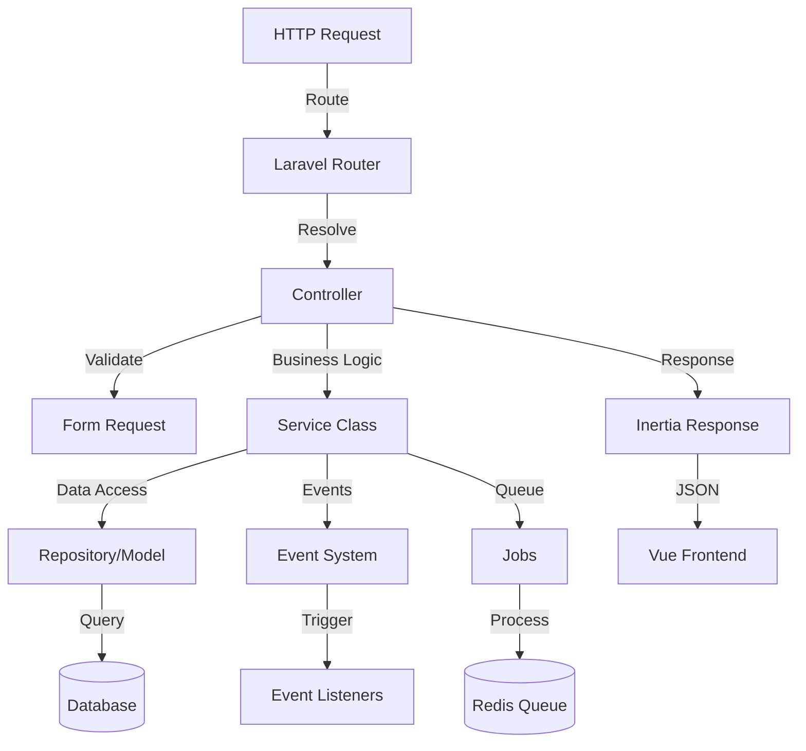

# Backend Architecture

Saucebase is built on Laravel 12 with a modular architecture that promotes separation of concerns, testability, and maintainability. This guide covers the backend structure, design patterns, and best practices.

## Technology Stack

| Technology          | Version | Purpose                              |
| ------------------- | ------- | ------------------------------------ |
| Laravel             | 12      | PHP framework                        |
| PHP                 | 8.4+    | Programming language                 |
| MySQL               | 8.0     | Primary database                     |
| Redis               | Latest  | Cache, sessions, queues              |
| Spatie Permission   | Latest  | Role-based access control            |
| Inertia.js          | 2.0     | Server-side routing adapter          |
| Laravel Modules     | Latest  | Modular structure                    |
| Filament            | 4       | Admin panel                          |

## Architecture Overview



## Directory Structure

### Core Application

```
app/
├── Console/
│   ├── Commands/          # Artisan commands
│   └── Kernel.php         # Command scheduling
├── Events/                # Application events
├── Exceptions/
│   └── Handler.php        # Exception handling
├── Helpers/
│   └── helpers.php        # Global helper functions
├── Http/
│   ├── Controllers/       # HTTP controllers
│   ├── Middleware/        # HTTP middleware
│   └── Requests/          # Form request validation
├── Jobs/                  # Queue jobs
├── Listeners/             # Event listeners
├── Models/                # Eloquent models
│   └── User.php
├── Policies/              # Authorization policies
├── Providers/             # Service providers
│   ├── AppServiceProvider.php
│   ├── BreadcrumbServiceProvider.php
│   ├── FilamentServiceProvider.php
│   ├── MacroServiceProvider.php
│   ├── ModuleServiceProvider.php
│   └── NavigationServiceProvider.php
└── Services/              # Business logic services
```

### Module Structure

```
modules/<ModuleName>/
├── app/
│   ├── Http/
│   │   ├── Controllers/
│   │   ├── Middleware/
│   │   └── Requests/
│   ├── Models/
│   ├── Services/
│   ├── Events/
│   ├── Listeners/
│   ├── Jobs/
│   ├── Policies/
│   └── Providers/
│       └── <ModuleName>ServiceProvider.php
├── config/
│   └── config.php
├── database/
│   ├── migrations/
│   ├── seeders/
│   └── factories/
├── lang/
│   ├── en/
│   └── pt_BR/
├── resources/
│   ├── js/
│   └── css/
├── routes/
│   ├── web.php
│   └── api.php
├── tests/
│   ├── Feature/
│   └── Unit/
└── module.json
```

## Service Providers

Service providers are the central place for bootstrapping application and module components.

### Core Service Providers

#### AppServiceProvider

Handles core application configuration:

```php
class AppServiceProvider extends ServiceProvider
{
    public function boot(): void
    {
        // Force HTTPS in production/staging
        if (in_array(config('app.env'), ['production', 'staging'])) {
            URL::forceScheme('https');
            $this->enableHttpsSecurityHeaders();
        }

        // Fix module event discovery
        Event::clearResolvedInstance(DiscoverEvents::class);
    }

    protected function enableHttpsSecurityHeaders(): void
    {
        Response::macro('withSecurityHeaders', function () {
            return $this
                ->header('Strict-Transport-Security', 'max-age=31536000; includeSubDomains')
                ->header('Content-Security-Policy', "upgrade-insecure-requests")
                ->header('X-Content-Type-Options', 'nosniff');
        });
    }
}
```

#### MacroServiceProvider

Centralized macro management:

```php
class MacroServiceProvider extends ServiceProvider
{
    public function boot(): void
    {
        $this->registerInertiaMacros();
    }

    protected function registerInertiaMacros(): void
    {
        // Enable SSR for specific response
        InertiaResponse::macro('withSSR', function () {
            Config::set('inertia.ssr.enabled', true);
            return $this;
        });

        // Disable SSR for specific response
        InertiaResponse::macro('withoutSSR', function () {
            Config::set('inertia.ssr.enabled', false);
            return $this;
        });
    }
}
```

#### ModuleServiceProvider (Abstract)

Base class for module service providers:

```php
abstract class ModuleServiceProvider extends ServiceProvider
{
    protected string $name;
    protected string $nameLower;
    protected array $commands = [];
    protected array $providers = [];

    public function boot(): void
    {
        $this->registerTranslations();
        $this->registerConfig();
        $this->registerViews();
        $this->loadMigrationsFrom(module_path($this->name, 'database/migrations'));

        // Share module data with Inertia
        Inertia::share([
            "{$this->nameLower}.config" => fn() => config($this->nameLower),
        ]);
    }

    public function register(): void
    {
        $this->registerProviders();
        $this->registerCommands();
    }
}
```

### Module Service Providers

Every module must have a service provider that extends `App\Providers\ModuleServiceProvider`. This base class handles common module concerns automatically.

#### How Module Providers Work

**Automatic Registration**: When a module is enabled in `modules_statuses.json`, Laravel automatically loads and registers its service provider. You don't need to add it to `config/app.php`.

**Base Class Benefits**: The `ModuleServiceProvider` abstract class provides:
- Translation loading from `modules/<Name>/lang/`
- Config merging from `modules/<Name>/config/`
- Migration discovery from `modules/<Name>/database/migrations/`
- Inertia data sharing (module config available in all Vue components)

This eliminates boilerplate and ensures consistent behavior across modules.

#### Module Provider Example

```php
// modules/Auth/app/Providers/AuthServiceProvider.php
class AuthServiceProvider extends ModuleServiceProvider
{
    protected string $name = 'Auth';
    protected string $nameLower = 'auth';

    protected array $commands = [
        Commands\SetupOAuthCommand::class,
    ];

    protected array $providers = [
        RouteServiceProvider::class,
    ];

    // Optional: Override boot for module-specific setup
    public function boot(): void
    {
        parent::boot(); // Always call parent

        // Add module-specific boot logic
        $this->registerEventListeners();
        $this->configureThirdPartyServices();
    }

    protected function registerEventListeners(): void
    {
        Event::listen(UserLoggedIn::class, UpdateLoginStats::class);
    }

    protected function configureThirdPartyServices(): void
    {
        if (config('auth.oauth.google.enabled')) {
            Socialite::extend('google', fn() => new GoogleProvider());
        }
    }
}
```

#### What Gets Registered

When a module's service provider boots:

1. **Routes**: Loaded from `routes/web.php` and `routes/api.php`
2. **Migrations**: Discovered from `database/migrations/`
3. **Translations**: Loaded from `lang/en/`, `lang/pt_BR/`, etc.
4. **Config**: Merged into global config as `config('modulename.key')`
5. **Commands**: Registered and available via `php artisan`
6. **Nested Providers**: Any providers in the `$providers` array are registered

All of this happens automatically when the module is enabled. Disable the module, and everything is unloaded.

#### Sharing Data with Inertia

The base `ModuleServiceProvider` automatically shares module config with all Inertia pages:

```php
// In ModuleServiceProvider base class
Inertia::share([
    "{$this->nameLower}.config" => fn() => config($this->nameLower),
]);
```

This means your Vue components can access module configuration:

```vue
<script setup lang="ts">
import { usePage } from '@inertiajs/vue3';

const page = usePage();
const authConfig = computed(() => page.props.auth.config);
</script>
```

#### Module Lifecycle

1. **Install**: Module copied to `modules/<Name>/`
2. **Enable**: Added to `modules_statuses.json`
3. **Boot**: Service provider loaded and `boot()` method called
4. **Register**: Module components registered (routes, migrations, etc.)
5. **Runtime**: Module fully integrated into application

**Learn more**: [Module System Architecture](/architecture/module-system) for detailed module lifecycle information, or [Modules Guide](/fundamentals/modules) for practical usage.

## Request Flow

### 1. Route Definition

```php
// routes/web.php (Core)
Route::get('/dashboard', [DashboardController::class, 'index'])
    ->middleware('auth')
    ->name('dashboard');

// modules/Auth/routes/web.php (Module)
Route::prefix('auth')->name('auth.')->group(function () {
    Route::get('/login', [AuthController::class, 'showLogin'])->name('login');
    Route::post('/login', [AuthController::class, 'login']);
});
```

### 2. Controller

Controllers handle HTTP requests, validate input, call services, and return responses.

```php
class PostController extends Controller
{
    public function __construct(
        private readonly PostService $postService
    ) {}

    public function store(StorePostRequest $request): RedirectResponse
    {
        // Validation already handled by FormRequest
        $post = $this->postService->create($request->validated());

        return redirect()
            ->route('post.show', $post)
            ->with('success', 'Post created successfully');
    }

    public function index(): Response
    {
        $posts = $this->postService->getPaginatedPosts();

        return Inertia::render('Posts/Index', [
            'posts' => $posts,
        ])->withSSR();
    }
}
```

**Controller Responsibilities**:
- Validate input (via Form Requests)
- Call service layer
- Return responses (Inertia, JSON, redirect)
- Handle authorization (via policies/gates)

**NOT Controller Responsibilities**:
- Business logic
- Database queries
- Email sending
- File uploads processing

### 3. Form Request Validation

```php
class StorePostRequest extends FormRequest
{
    public function authorize(): bool
    {
        return $this->user()->can('create', Post::class);
    }

    public function rules(): array
    {
        return [
            'title' => ['required', 'string', 'max:255'],
            'content' => ['required', 'string'],
            'status' => ['required', Rule::in(['draft', 'published'])],
            'tags' => ['array'],
            'tags.*' => ['exists:tags,id'],
        ];
    }

    public function messages(): array
    {
        return [
            'title.required' => 'Please provide a post title',
            'content.required' => 'Post content cannot be empty',
        ];
    }
}
```

### 4. Service Layer

Services contain business logic and orchestrate operations:

```php
class PostService
{
    public function create(array $data): Post
    {
        DB::beginTransaction();

        try {
            $post = Post::create([
                'title' => $data['title'],
                'content' => $data['content'],
                'status' => $data['status'],
                'author_id' => auth()->id(),
            ]);

            if (isset($data['tags'])) {
                $post->tags()->sync($data['tags']);
            }

            event(new PostCreated($post));

            DB::commit();

            return $post->fresh('tags');
        } catch (\Exception $e) {
            DB::rollBack();
            throw $e;
        }
    }

    public function getPaginatedPosts(int $perPage = 15): LengthAwarePaginator
    {
        return Post::with(['author', 'tags'])
            ->latest()
            ->paginate($perPage);
    }

    public function publish(Post $post): Post
    {
        $post->update(['status' => 'published', 'published_at' => now()]);

        event(new PostPublished($post));

        return $post;
    }
}
```

**Service Layer Responsibilities**:
- Business logic
- Transaction management
- Event dispatching
- Calling other services
- Data transformation

### 5. Models

Eloquent models represent database tables and relationships:

```php
class Post extends Model
{
    use HasFactory, SoftDeletes;

    protected $fillable = [
        'title',
        'content',
        'status',
        'author_id',
        'published_at',
    ];

    protected $casts = [
        'published_at' => 'datetime',
    ];

    // Relationships
    public function author(): BelongsTo
    {
        return $this->belongsTo(User::class, 'author_id');
    }

    public function tags(): BelongsToMany
    {
        return $this->belongsToMany(Tag::class);
    }

    public function comments(): HasMany
    {
        return $this->hasMany(Comment::class);
    }

    // Scopes
    public function scopePublished(Builder $query): void
    {
        $query->where('status', 'published');
    }

    public function scopeByAuthor(Builder $query, User $author): void
    {
        $query->where('author_id', $author->id);
    }

    // Accessors
    public function getExcerptAttribute(): string
    {
        return Str::limit($this->content, 200);
    }

    // Events
    protected static function booted(): void
    {
        static::deleting(function (Post $post) {
            $post->comments()->delete();
        });
    }
}
```

## Middleware

Middleware filters HTTP requests entering your application:

```php
// app/Http/Middleware/HandleInertiaRequests.php
class HandleInertiaRequests extends Middleware
{
    public function handle(Request $request, Closure $next): Response
    {
        // Disable SSR by default (opt-in per route)
        Config::set('inertia.ssr.enabled', false);

        return parent::handle($request, $next);
    }

    public function share(Request $request): array
    {
        return [
            ...parent::share($request),
            'auth' => [
                'user' => $request->user(),
            ],
            'flash' => [
                'success' => $request->session()->get('success'),
                'error' => $request->session()->get('error'),
            ],
            'locale' => app()->getLocale(),
            'ziggy' => fn() => [
                ...(new Ziggy)->toArray(),
                'location' => $request->url(),
                'query' => $request->query(),
            ],
        ];
    }
}
```

### Applying Middleware

```php
// Global middleware (bootstrap/app.php)
->withMiddleware(function (Middleware $middleware) {
    $middleware->web(append: [
        HandleInertiaRequests::class,
    ]);
})

// Route middleware
Route::middleware(['auth', 'role:admin'])->group(function () {
    Route::get('/admin', [AdminController::class, 'index']);
});

// Controller middleware
class DashboardController extends Controller
{
    public function __construct()
    {
        $this->middleware('auth');
        $this->middleware('verified')->only('show');
    }
}
```

## Authentication & Authorization

### Authentication

```php
// Login
Auth::attempt($credentials);

// Logout
Auth::logout();

// Check authentication
if (Auth::check()) {
    // User is authenticated
}

// Get authenticated user
$user = Auth::user();
$user = auth()->user();
$user = $request->user();
```

### Authorization with Policies

```php
// app/Policies/PostPolicy.php
class PostPolicy
{
    public function view(User $user, Post $post): bool
    {
        return $post->status === 'published' || $post->author_id === $user->id;
    }

    public function create(User $user): bool
    {
        return $user->hasRole('author');
    }

    public function update(User $user, Post $post): bool
    {
        return $post->author_id === $user->id;
    }

    public function delete(User $user, Post $post): bool
    {
        return $user->hasRole('admin') || $post->author_id === $user->id;
    }
}

// Register policy
class AppServiceProvider extends ServiceProvider
{
    protected $policies = [
        Post::class => PostPolicy::class,
    ];
}
```

### Using Authorization

```php
// In controller
public function edit(Post $post)
{
    $this->authorize('update', $post);

    return Inertia::render('Posts/Edit', ['post' => $post]);
}

// In middleware
Route::put('/posts/{post}', [PostController::class, 'update'])
    ->middleware('can:update,post');

// In blade/vue
@can('update', $post)
    <button>Edit Post</button>
@endcan

// In code
if ($user->can('update', $post)) {
    // User can update
}

Gate::allows('update', $post);
Gate::denies('update', $post);
```

### Role-Based Access Control (Spatie Permission)

```php
// Assign roles
$user->assignRole('admin');
$user->assignRole(['editor', 'author']);

// Check roles
if ($user->hasRole('admin')) {
    // User is admin
}

if ($user->hasAnyRole(['admin', 'editor'])) {
    // User has at least one role
}

// Assign permissions
$user->givePermissionTo('edit posts');

// Check permissions
if ($user->can('edit posts')) {
    // User can edit posts
}

// Middleware
Route::middleware('role:admin')->group(function () {
    // Admin only routes
});

Route::middleware('permission:edit posts')->group(function () {
    // Permission-based routes
});
```

## Events & Listeners

### Defining Events

```php
// app/Events/PostCreated.php
class PostCreated
{
    use Dispatchable, SerializesModels;

    public function __construct(
        public Post $post
    ) {}
}
```

### Defining Listeners

```php
// app/Listeners/SendPostNotification.php
class SendPostNotification
{
    public function handle(PostCreated $event): void
    {
        $subscribers = User::whereHas('subscriptions', function ($query) use ($event) {
            $query->where('author_id', $event->post->author_id);
        })->get();

        foreach ($subscribers as $subscriber) {
            Mail::to($subscriber)->send(new NewPostNotification($event->post));
        }
    }
}
```

### Registering Event Listeners

```php
// app/Providers/AppServiceProvider.php
protected $listen = [
    PostCreated::class => [
        SendPostNotification::class,
        UpdateAuthorStats::class,
    ],
];

// Or use automatic discovery
Event::listen(PostCreated::class, SendPostNotification::class);

// Or inline listener
Event::listen(PostCreated::class, function (PostCreated $event) {
    // Handle event
});
```

### Dispatching Events

```php
// Dispatch immediately
event(new PostCreated($post));

// Or
PostCreated::dispatch($post);

// Dispatch if condition is true
PostCreated::dispatchIf($condition, $post);
PostCreated::dispatchUnless($condition, $post);
```

## Jobs & Queues

### Defining Jobs

```php
// app/Jobs/ProcessVideoUpload.php
class ProcessVideoUpload implements ShouldQueue
{
    use Dispatchable, InteractsWithQueue, Queueable, SerializesModels;

    public function __construct(
        public Video $video
    ) {}

    public function handle(VideoProcessingService $service): void
    {
        $service->process($this->video);
    }

    public function failed(\Throwable $exception): void
    {
        Log::error('Video processing failed', [
            'video_id' => $this->video->id,
            'error' => $exception->getMessage(),
        ]);
    }
}
```

### Dispatching Jobs

```php
// Dispatch immediately
ProcessVideoUpload::dispatch($video);

// Dispatch to specific queue
ProcessVideoUpload::dispatch($video)->onQueue('video-processing');

// Dispatch with delay
ProcessVideoUpload::dispatch($video)->delay(now()->addMinutes(10));

// Dispatch after database transaction commits
ProcessVideoUpload::dispatch($video)->afterCommit();

// Chain jobs
Bus::chain([
    new ProcessVideoUpload($video),
    new SendVideoNotification($video),
    new UpdateVideoStats($video),
])->dispatch();
```

### Queue Configuration

```php
// config/queue.php
'connections' => [
    'redis' => [
        'driver' => 'redis',
        'connection' => 'default',
        'queue' => env('REDIS_QUEUE', 'default'),
        'retry_after' => 90,
        'block_for' => null,
    ],
],
```

### Running Queue Workers

```bash
# Process jobs once
php artisan queue:work

# Process jobs with options
php artisan queue:work redis --queue=high,default --tries=3

# Process jobs in the background
php artisan queue:listen --tries=1
```

## API Development

### API Routes

```php
// routes/api.php
Route::middleware('auth:sanctum')->group(function () {
    Route::apiResource('posts', PostApiController::class);

    Route::get('/user', function (Request $request) {
        return $request->user();
    });
});
```

### API Controllers

```php
class PostApiController extends Controller
{
    public function index(): JsonResponse
    {
        $posts = Post::with('author')->paginate();

        return response()->json($posts);
    }

    public function store(StorePostRequest $request): JsonResponse
    {
        $post = Post::create($request->validated());

        return response()->json($post, 201);
    }

    public function show(Post $post): JsonResponse
    {
        $post->load(['author', 'tags']);

        return response()->json($post);
    }
}
```

### API Resources

```php
// app/Http/Resources/PostResource.php
class PostResource extends JsonResource
{
    public function toArray(Request $request): array
    {
        return [
            'id' => $this->id,
            'title' => $this->title,
            'excerpt' => $this->excerpt,
            'content' => $this->when($request->user()?->can('view', $this->resource), $this->content),
            'author' => new UserResource($this->whenLoaded('author')),
            'tags' => TagResource::collection($this->whenLoaded('tags')),
            'created_at' => $this->created_at->toIso8601String(),
        ];
    }
}

// Usage
return PostResource::collection(Post::paginate());
return new PostResource($post);
```

## Best Practices

### ✅ Do

- Keep controllers thin (validation, call service, return response)
- Put business logic in service classes
- Use form requests for validation
- Use policies for authorization
- Use events for decoupled side effects
- Use jobs for long-running tasks
- Use repositories for complex queries
- Type-hint dependencies (automatic injection)
- Use transactions for multi-step operations
- Cache expensive queries

### ❌ Don't

- Put business logic in controllers
- Use raw SQL queries (use Eloquent/Query Builder)
- Skip validation
- Hardcode authorization checks
- Send emails synchronously
- Process uploads synchronously
- Use closures in route files (breaks route caching)
- Query the database in loops (N+1 problem)
- Catch exceptions you can't handle
- Skip testing

## Next Steps

- [Frontend Architecture](/architecture/frontend) - Understand the Vue frontend
- [Modules](/fundamentals/modules) - Deep dive into the modular system
- [Coding Standards](/development/coding-standards) - Best practices and conventions
