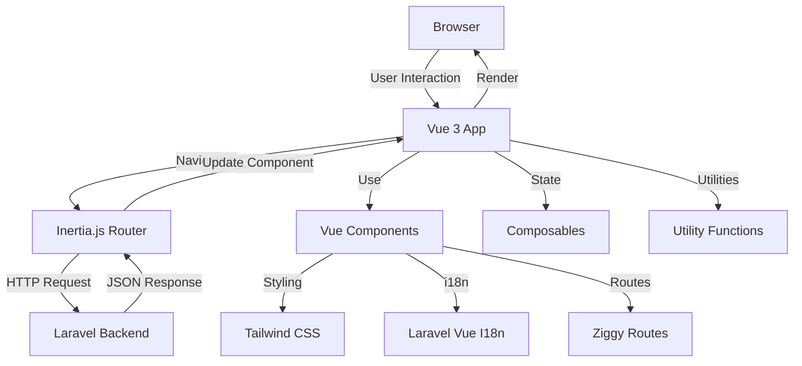

# Frontend Architecture

Saucebase uses a modern frontend stack built on Vue 3, Inertia.js, TypeScript, and Tailwind CSS 4. This guide explains the frontend architecture, component structure, and build system.

## Technology Stack

| Technology      | Version | Purpose                                    |
| --------------- | ------- | ------------------------------------------ |
| Vue 3           | Latest  | Progressive JavaScript framework           |
| Inertia.js      | 2.0     | SPA framework without API                  |
| TypeScript      | 5.8     | Type-safe JavaScript                       |
| Tailwind CSS    | 4.0     | Utility-first CSS framework                |
| Vite            | 6.4     | Build tool with HMR                        |
| Laravel Vue I18n| Latest  | Internationalization                       |
| Ziggy           | 2.0     | Laravel routes in JavaScript               |

## Architecture Overview



## Directory Structure

```
resources/js/
├── app.ts                  # Main entry point (CSR)
├── ssr.ts                  # SSR entry point
├── components/             # Reusable components
│   ├── ui/                # shadcn-vue components
│   │   ├── button/
│   │   ├── input/
│   │   └── ...
│   ├── LanguageSelector.vue
│   └── ...
├── pages/                  # Inertia pages (core app)
│   ├── Index.vue
│   ├── Dashboard.vue
│   └── ...
├── lib/                    # Utility libraries
│   ├── utils.ts           # Utility functions
│   ├── moduleSetup.ts     # Module lifecycle
│   └── ...
├── types/                  # TypeScript definitions
│   └── global.d.ts
└── ...

modules/<ModuleName>/resources/js/
├── app.ts                  # Module setup (optional)
├── pages/                  # Module-specific pages
│   ├── Login.vue
│   └── ...
├── components/             # Module components
│   └── ...
└── ...
```

## Entry Points

### Client-Side Rendering (app.ts)

Main entry point for browser rendering:

```typescript
// resources/js/app.ts
import { createApp, h, DefineComponent } from 'vue';
import { createInertiaApp } from '@inertiajs/vue3';
import { ZiggyVue } from '../../vendor/tightenco/ziggy';
import { resolveModularPageComponent } from './lib/utils';
import { i18nVue } from 'laravel-vue-i18n';
import { setupModules, afterMountModules } from './lib/moduleSetup';

createInertiaApp({
    resolve: (name) => resolveModularPageComponent(name, import.meta.glob<DefineComponent>([
        './pages/**/*.vue',
        '../../../modules/*/resources/js/pages/**/*.vue'
    ])),

    setup({ el, App, props, plugin }) {
        const app = createApp({ render: () => h(App, props) });

        // Register plugins
        app.use(plugin);
        app.use(ZiggyVue);
        app.use(i18nVue, {
            resolve: async (lang: string) => {
                const langs = import.meta.glob<{ default: any }>('../../lang/*.json');
                return await langs[`../../lang/${lang}.json`]();
            },
        });

        // Module setup lifecycle
        setupModules(app);

        // Mount app
        app.mount(el);

        // Post-mount lifecycle
        afterMountModules(app);

        return app;
    },
});
```

### Server-Side Rendering (ssr.ts)

Entry point for SSR server:

```typescript
// resources/js/ssr.ts
import { createSSRApp, h, DefineComponent } from 'vue';
import { renderToString } from '@vue/server-renderer';
import { createInertiaApp } from '@inertiajs/vue3';
import createServer from '@inertiajs/vue3/server';
import { ZiggyVue } from '../../vendor/tightenco/ziggy';
import { resolveModularPageComponent } from './lib/utils';
import { i18nVue } from 'laravel-vue-i18n';
import { setupModules } from './lib/moduleSetup';

createServer((page) =>
    createInertiaApp({
        page,
        render: renderToString,
        resolve: (name) => resolveModularPageComponent(name, import.meta.glob<DefineComponent>([
            './pages/**/*.vue',
            '../../../modules/*/resources/js/pages/**/*.vue'
        ])),

        setup({ App, props, plugin }) {
            const app = createSSRApp({ render: () => h(App, props) });

            // Register plugins
            app.use(plugin);
            app.use(ZiggyVue, {
                ...page.props.ziggy,
                location: new URL(page.props.ziggy.location),
            });
            app.use(i18nVue, {
                resolve: (lang: string) => {
                    const langs = import.meta.glob<{ default: any }>('../../lang/*.json', { eager: true });
                    return langs[`../../lang/${lang}.json`].default;
                },
            });

            // Module setup (no afterMount in SSR)
            setupModules(app);

            return app;
        },
    })
);
```

## Module Page Resolution

Saucebase extends Inertia to support modular architecture with **namespace syntax**.

### Resolution Logic

```typescript
// resources/js/lib/utils.ts
import type { DefineComponent } from 'vue';

export async function resolveModularPageComponent(
    name: string,
    pages: Record<string, () => Promise<DefineComponent>>
): Promise<DefineComponent> {
    // Check for module namespace syntax (Module::Page)
    if (name.includes('::')) {
        const [moduleName, pagePath] = name.split('::');
        const path = `../../../modules/${moduleName}/resources/js/pages/${pagePath}.vue`;

        const resolvedPage = pages[path];
        if (!resolvedPage) {
            throw new Error(`Page component not found: ${path}`);
        }

        return (await resolvedPage()).default;
    }

    // Core pages
    const path = `./pages/${name}.vue`;
    const resolvedPage = pages[path];

    if (!resolvedPage) {
        throw new Error(`Page component not found: ${path}`);
    }

    return (await resolvedPage()).default;
}
```

### Usage in Controllers

```php
// Core page
return Inertia::render('Dashboard');
// Resolves to: resources/js/pages/Dashboard.vue

// Module page
return Inertia::render('Auth::Login');
// Resolves to: modules/Auth/resources/js/pages/Login.vue
```

## Module Lifecycle

Modules can export setup hooks for initialization:

```typescript
// modules/Auth/resources/js/app.ts
import type { App } from 'vue';

export default {
    // Called before app mounts (both CSR and SSR)
    setup(app: App) {
        // Register plugins, components, directives
        app.component('CustomButton', CustomButton);
        app.directive('focus', focusDirective);
    },

    // Called after app mounts (CSR only, not SSR)
    afterMount(app: App) {
        // Initialize services that require DOM
        initAnalytics();
        initWebSocket();
    },
};
```

### Module Setup Orchestration

```typescript
// resources/js/lib/moduleSetup.ts
import type { App } from 'vue';

// Dynamically import module setup files
const moduleSetups = import.meta.glob<{ default: any }>(
    '../../../modules/*/resources/js/app.ts',
    { eager: true }
);

export function setupModules(app: App) {
    Object.values(moduleSetups).forEach((moduleSetup) => {
        if (moduleSetup.default?.setup) {
            moduleSetup.default.setup(app);
        }
    });
}

export function afterMountModules(app: App) {
    Object.values(moduleSetups).forEach((moduleSetup) => {
        if (moduleSetup.default?.afterMount) {
            moduleSetup.default.afterMount(app);
        }
    });
}
```

## Component Architecture

### Composition API Style

All components use Vue 3 Composition API with `<script setup>`:

```vue
<script setup lang="ts">
import { ref, computed } from 'vue';
import { useForm, usePage } from '@inertiajs/vue3';

// Define props
interface Props {
    user: {
        id: number;
        name: string;
        email: string;
    };
}

const props = defineProps<Props>();

// Define emits
const emit = defineEmits<{
    update: [user: Props['user']];
    delete: [id: number];
}>();

// Reactive state
const isEditing = ref(false);

// Computed properties
const displayName = computed(() => {
    return props.user.name || props.user.email;
});

// Methods
const startEdit = () => {
    isEditing.value = true;
};

// Inertia form
const form = useForm({
    name: props.user.name,
    email: props.user.email,
});

const submit = () => {
    form.put(route('user.update', { user: props.user.id }), {
        onSuccess: () => {
            isEditing.value = false;
            emit('update', props.user);
        },
    });
};
</script>

<template>
    <div class="user-card">
        <h3>{{ displayName }}</h3>
        <button v-if="!isEditing" @click="startEdit">Edit</button>

        <form v-else @submit.prevent="submit">
            <input v-model="form.name" type="text" />
            <input v-model="form.email" type="email" />
            <button type="submit" :disabled="form.processing">Save</button>
        </form>
    </div>
</template>
```

### UI Components (shadcn-vue)

Saucebase uses shadcn-vue style components in `resources/js/components/ui/`:

```
components/ui/
├── button/
│   ├── Button.vue
│   └── index.ts
├── input/
│   ├── Input.vue
│   └── index.ts
├── card/
│   ├── Card.vue
│   ├── CardHeader.vue
│   ├── CardContent.vue
│   └── index.ts
└── ...
```

**Copy-and-own philosophy**: These components are copied into your project and can be customized directly.

### Using UI Components

```vue
<script setup lang="ts">
import { Button } from '@/components/ui/button';
import { Input } from '@/components/ui/input';
import { Card, CardHeader, CardContent } from '@/components/ui/card';
</script>

<template>
    <Card>
        <CardHeader>
            <h2>Login</h2>
        </CardHeader>
        <CardContent>
            <Input v-model="form.email" type="email" placeholder="Email" />
            <Button @click="submit">Login</Button>
        </CardContent>
    </Card>
</template>
```

## State Management

Saucebase doesn't include a global state management library by default. Use these patterns:

### 1. Composables (Recommended)

Create reusable stateful logic with composables:

```typescript
// resources/js/composables/useAuth.ts
import { ref, computed } from 'vue';
import { usePage } from '@inertiajs/vue3';

export function useAuth() {
    const page = usePage();

    const user = computed(() => page.props.auth?.user);
    const isAuthenticated = computed(() => !!user.value);

    return {
        user,
        isAuthenticated,
    };
}
```

Usage:

```vue
<script setup lang="ts">
import { useAuth } from '@/composables/useAuth';

const { user, isAuthenticated } = useAuth();
</script>

<template>
    <div v-if="isAuthenticated">
        Welcome, {{ user.name }}!
    </div>
</template>
```

### 2. Shared Inertia Props

Share data globally via Inertia middleware:

```php
// app/Http/Middleware/HandleInertiaRequests.php
public function share(Request $request): array
{
    return [
        ...parent::share($request),
        'auth' => [
            'user' => $request->user(),
        ],
        'flash' => [
            'success' => $request->session()->get('success'),
            'error' => $request->session()->get('error'),
        ],
        'locale' => app()->getLocale(),
    ];
}
```

Access in any component:

```vue
<script setup lang="ts">
import { usePage } from '@inertiajs/vue3';

const page = usePage();
const flash = computed(() => page.props.flash);
const locale = computed(() => page.props.locale);
</script>
```

### 3. Pinia (Optional)

For complex state management, install Pinia:

```bash
npm install pinia
```

```typescript
// resources/js/app.ts
import { createPinia } from 'pinia';

const pinia = createPinia();
app.use(pinia);
```

## Styling with Tailwind CSS 4

### Configuration

```javascript
// tailwind.config.js
export default {
    content: [
        './resources/**/*.blade.php',
        './resources/**/*.js',
        './resources/**/*.vue',
        './modules/**/resources/**/*.vue',
    ],
    theme: {
        extend: {
            colors: {
                primary: 'oklch(var(--color-primary) / <alpha-value>)',
                secondary: 'oklch(var(--color-secondary) / <alpha-value>)',
            },
        },
    },
    plugins: [],
};
```

### Custom CSS Variables

```css
/* resources/css/theme.css */
@import "tailwindcss";

@theme {
    --color-primary: 0.51 0.17 278.25;        /* Purple */
    --color-secondary: 0.65 0.1229 217.1824;  /* Blue */
}

@media (prefers-color-scheme: dark) {
    @theme {
        --color-primary: 0.55 0.17 282.5;
        --color-secondary: 0.75 0.1563 184.617;
    }
}
```

### Usage

```vue
<template>
    <div class="bg-primary text-white p-4">
        <h1 class="text-2xl font-bold">Hello</h1>
        <p class="text-secondary">Welcome to Saucebase</p>
    </div>
</template>
```

## Internationalization (i18n)

### Translation Files

```
lang/
├── en.json
│   {
│       "welcome": "Welcome",
│       "logout": "Logout"
│   }
└── pt_BR.json
    {
        "welcome": "Bem-vindo",
        "logout": "Sair"
    }
```

### Usage in Components

```vue
<script setup lang="ts">
import { trans } from 'laravel-vue-i18n';
</script>

<template>
    <div>
        <h1>{{ trans('welcome') }}</h1>
        <button>{{ trans('logout') }}</button>
    </div>
</template>
```

### Change Locale

```vue
<script setup lang="ts">
import { router } from '@inertiajs/vue3';
import { loadLanguageAsync } from 'laravel-vue-i18n';

const changeLocale = async (locale: string) => {
    await loadLanguageAsync(locale);
    router.visit(route('locale', { locale }));
};
</script>

<template>
    <button @click="changeLocale('en')">English</button>
    <button @click="changeLocale('pt_BR')">Português</button>
</template>
```

## Build System (Vite)

### Configuration

```javascript
// vite.config.js
import { defineConfig } from 'vite';
import laravel from 'laravel-vite-plugin';
import vue from '@vitejs/plugin-vue';
import { collectModuleAssetsPaths, collectModuleLangPaths } from './module-loader.js';

export default defineConfig({
    plugins: [
        laravel({
            input: ['resources/css/app.css', 'resources/js/app.ts', ...collectModuleAssetsPaths()],
            ssr: 'resources/js/ssr.ts',
            refresh: true,
        }),
        vue({
            template: {
                transformAssetUrls: {
                    base: null,
                    includeAbsolute: false,
                },
            },
        }),
    ],
    resolve: {
        alias: {
            '@': '/resources/js',
            '@modules': '/modules/',
            'ziggy-js': '/vendor/tightenco/ziggy',
        },
    },
    ssr: {
        noExternal: ['laravel-vue-i18n'],
    },
});
```

### Module Asset Collection

The `module-loader.js` automatically discovers and includes enabled module assets:

```javascript
// module-loader.js
export function collectModuleAssetsPaths() {
    const enabledModules = getEnabledModules();
    const assetPaths = [];

    enabledModules.forEach((moduleName) => {
        const configPath = `./modules/${moduleName}/vite.config.js`;
        if (fs.existsSync(configPath)) {
            const config = require(configPath);
            const paths = config.default?.paths || [];
            paths.forEach((path) => {
                assetPaths.push(`modules/${moduleName}/resources/${path}`);
            });
        }
    });

    return assetPaths;
}
```

### Development vs Production

```bash
# Development (HMR enabled)
npm run dev

# Production build (optimized, minified)
npm run build

# SSR build
npm run build:ssr
```

## TypeScript Integration

### Type Definitions

```typescript
// resources/js/types/global.d.ts
import { PageProps as InertiaPageProps } from '@inertiajs/core';
import { AxiosInstance } from 'axios';
import { route as ziggyRoute } from 'ziggy-js';

declare global {
    interface Window {
        axios: AxiosInstance;
    }

    var route: typeof ziggyRoute;
}

export interface User {
    id: number;
    name: string;
    email: string;
    email_verified_at?: string;
}

export interface Auth {
    user: User | null;
}

export type PageProps<T extends Record<string, unknown> = Record<string, unknown>> = T & {
    auth: Auth;
    flash: {
        success?: string;
        error?: string;
    };
    locale: string;
    ziggy: {
        location: string;
        query: Record<string, any>;
    };
};

declare module 'vue' {
    interface ComponentCustomProperties {
        route: typeof ziggyRoute;
    }
}
```

### Using Types in Components

```vue
<script setup lang="ts">
import type { PageProps, User } from '@/types/global';

interface Props {
    users: User[];
}

const props = defineProps<Props>();

// Type-safe page props
import { usePage } from '@inertiajs/vue3';
const page = usePage<PageProps>();

// Auto-completion works!
const user = page.props.auth.user;
const flash = page.props.flash;
</script>
```

## Performance Optimization

### Code Splitting

Automatically handled by Vite:

```vue
<script setup lang="ts">
// Lazy load heavy components
import { defineAsyncComponent } from 'vue';

const HeavyChart = defineAsyncComponent(() =>
    import('@/components/HeavyChart.vue')
);
</script>

<template>
    <Suspense>
        <template #default>
            <HeavyChart :data="chartData" />
        </template>
        <template #fallback>
            <div>Loading chart...</div>
        </template>
    </Suspense>
</template>
```

### Conditional Rendering

```vue
<template>
    <!-- Use v-if for infrequent toggles -->
    <div v-if="isAuthenticated">
        <Dashboard />
    </div>

    <!-- Use v-show for frequent toggles -->
    <div v-show="showPanel">
        <Panel />
    </div>
</template>
```

### Memoization

```vue
<script setup lang="ts">
import { computed } from 'vue';

const props = defineProps<{ items: Item[] }>();

// Expensive computation cached
const sortedItems = computed(() => {
    return [...props.items].sort((a, b) => a.name.localeCompare(b.name));
});
</script>
```

## Best Practices

### ✅ Do

- Use TypeScript for type safety
- Follow Composition API style with `<script setup>`
- Use composables for reusable logic
- Leverage Inertia shared props for global data
- Use Tailwind utility classes
- Lazy load heavy components
- Use `v-if` vs `v-show` appropriately

### ❌ Don't

- Use Options API (deprecated in Saucebase)
- Create global state without composables
- Bypass Inertia for navigation
- Inline complex logic in templates
- Use `any` type in TypeScript
- Import entire libraries (import only what you need)

## Next Steps

- [Backend Architecture](/architecture/backend) - Understand the Laravel backend
- [Commands](/development/commands) - Build and development commands
