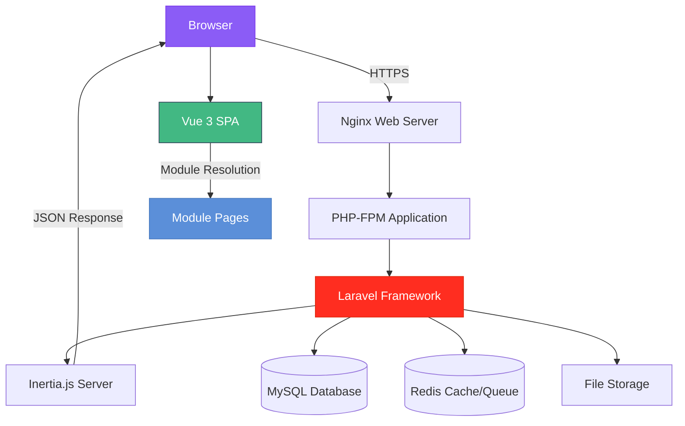
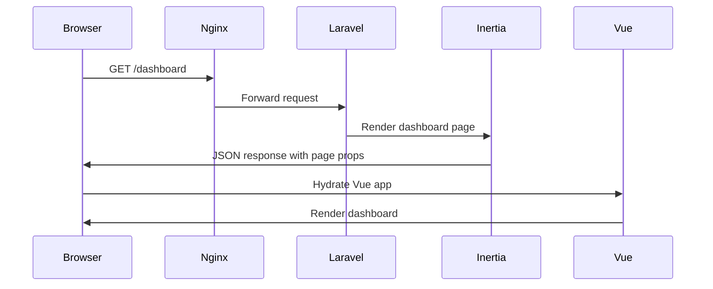
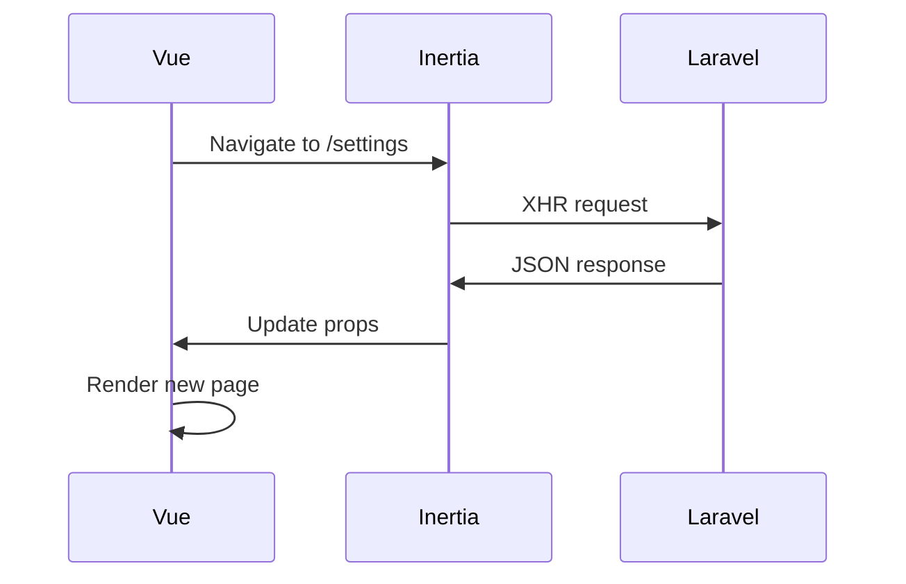
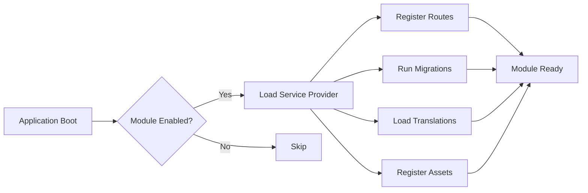
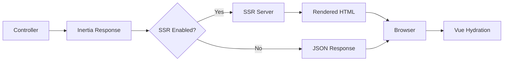
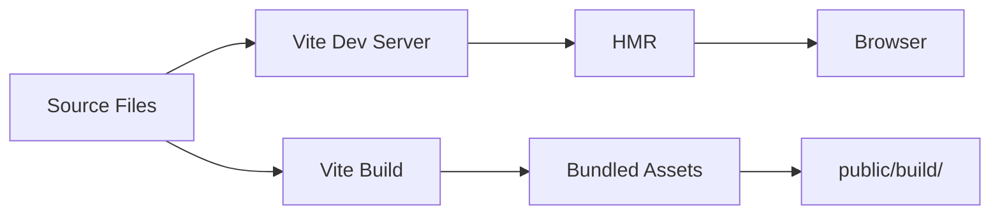
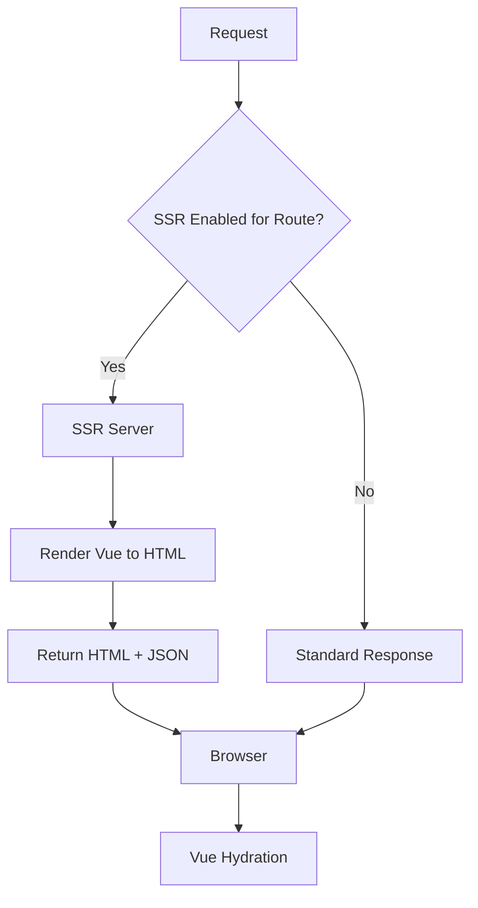
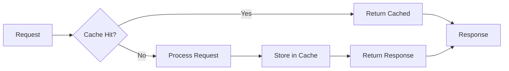
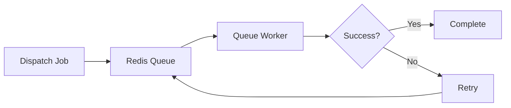

# Architecture Overview

Saucebase is built on a modular architecture that combines Laravel's backend power with Vue 3's reactive frontend, connected seamlessly through Inertia.js.

## High-Level Architecture



## Request Flow

### 1. Client Request



**Steps:**

1. **Browser** requests a route (e.g., `/dashboard`)
2. **Nginx** forwards to PHP-FPM
3. **Laravel** routes to controller
4. **Controller** returns Inertia response
5. **Inertia** sends JSON with component name and props
6. **Vue SPA** receives response and renders appropriate page
7. **Module Resolution** loads page from module or core

### 2. Subsequent Navigation (SPA)



After initial page load, navigation is handled client-side:

1. **Vue** intercepts link clicks
2. **Inertia** makes XHR request to Laravel
3. **Laravel** returns JSON (not full HTML)
4. **Vue** swaps page component without full refresh

## Core Components

### Backend Stack

#### Laravel 12
- **Routes**: Define application endpoints
- **Controllers**: Handle HTTP requests
- **Models**: Interact with database (Eloquent ORM)
- **Services**: Business logic layer
- **Middleware**: Request/response filtering
- **Jobs**: Background processing

#### Inertia.js Server
- **Response Adapter**: Converts controller responses to JSON
- **Shared Data**: Provides props to all pages (auth, flash, locale)
- **SSR Support**: Optional server-side rendering
- **Middleware**: `HandleInertiaRequests.php`

#### Database Layer
- **MySQL 8**: Primary database
- **Redis**: Cache, sessions, queues
- **Eloquent ORM**: Database abstraction

### Frontend Stack

#### Vue 3
- **Composition API**: Modern reactive programming
- **Single File Components**: `.vue` files
- **TypeScript**: Type safety
- **Reactivity**: Automatic UI updates

#### Inertia.js Client
- **Page Components**: Vue pages rendered by Inertia
- **Form Helpers**: Handle form submissions
- **Progress Indicator**: Loading states
- **Visit API**: Client-side navigation

#### Build Tools
- **Vite 6**: Fast dev server and bundler
- **TypeScript 5.8**: Type checking
- **Tailwind CSS 4**: Utility-first CSS

## Modular System

Modules are self-contained feature packages that integrate seamlessly:

### Module Structure

```
modules/Auth/
├── app/                    # Backend: Controllers, Models, Services
├── resources/js/           # Frontend: Vue pages and components
├── routes/                 # Module-specific routes
├── database/               # Migrations and seeders
└── lang/                   # Translations
```

### Module Loading



**Discovery Process:**

1. Check `modules_statuses.json` for enabled modules
2. Auto-load module service providers
3. Register module routes automatically
4. Discover module assets for Vite
5. Load module translations

### Page Resolution

Inertia supports **namespace syntax** for module pages:

```php
// Core page
return inertia('Dashboard');
// → resources/js/pages/Dashboard.vue

// Module page
return inertia('Auth::Login');
// → modules/Auth/resources/js/pages/Login.vue
```

Implementation in `resources/js/lib/utils.ts`:

```typescript
export function resolveModularPageComponent(name: string) {
  if (name.includes('::')) {
    const [moduleName, pageName] = name.split('::');
    return import(`../../modules/${moduleName}/resources/js/pages/${pageName}.vue`);
  }
  return import(`../pages/${name}.vue`);
}
```

## Data Flow

### Backend to Frontend



**Props Flow:**

```php
// Controller
return inertia('Users/Index', [
    'users' => User::paginate(10),
    'filters' => $request->only(['search', 'role']),
]);
```

```vue
<!-- Vue Component -->
<script setup lang="ts">
const props = defineProps<{
  users: PaginatedData<User>;
  filters: { search?: string; role?: string };
}>();
</script>
```

### Frontend to Backend

```typescript
// Form submission with Inertia
import { useForm } from '@inertiajs/vue3';

const form = useForm({
  name: '',
  email: '',
});

function submit() {
  form.post('/users', {
    onSuccess: () => {
      // Handle success
    },
  });
}
```

## State Management

### Shared Data (Global State)

Provided by `HandleInertiaRequests` middleware:

```php
public function share(Request $request): array
{
    return array_merge(parent::share($request), [
        'auth' => [
            'user' => $request->user(),
        ],
        'flash' => [
            'success' => $request->session()->get('success'),
            'error' => $request->session()->get('error'),
        ],
        'locale' => app()->getLocale(),
    ]);
}
```

Accessible in all Vue components via `usePage().props`:

```vue
<script setup lang="ts">
import { usePage } from '@inertiajs/vue3';

const page = usePage();
const user = computed(() => page.props.auth.user);
</script>
```

### Component State

Use Vue composables for shared reactive state:

```typescript
// composables/useTheme.ts
export function useTheme() {
  const theme = ref<'light' | 'dark'>('light');

  function toggleTheme() {
    theme.value = theme.value === 'light' ? 'dark' : 'light';
  }

  return { theme, toggleTheme };
}
```

## Asset Pipeline



### Development Mode

```bash
npm run dev
```

- Vite dev server with HMR
- No bundling (instant updates)
- Source maps enabled

### Production Build

```bash
npm run build
```

- Minification
- Tree shaking
- Code splitting
- Asset versioning
- SSR bundle generation

## Server-Side Rendering (SSR)



**How It Works:**

1. SSR server (Node.js) runs continuously
2. Middleware disables SSR by default per-request
3. Controllers opt-in with `->withSSR()`
4. Vue app renders server-side
5. HTML sent to browser with embedded JSON
6. Vue "hydrates" (attaches to existing HTML)

Learn more: [SSR Guide](/fundamentals/ssr)

## Security Layers

### Backend Security

- **CSRF Protection**: Automatic token verification
- **SQL Injection**: Eloquent ORM parameter binding
- **XSS Protection**: Blade/Vue automatic escaping
- **Authentication**: Laravel Sanctum/session-based
- **Authorization**: Gates and policies

### Frontend Security

- **Auto-escaping**: Vue templates escape by default
- **Content Security Policy**: Configured in `AppServiceProvider`
- **HTTPS Only**: Enforced in production
- **Input Validation**: Both client and server-side

## Caching Strategy



**Cache Layers:**

1. **Redis**: Application cache, sessions, queues
2. **Opcache**: PHP bytecode cache
3. **Browser Cache**: Static assets (via Vite versioning)
4. **CDN**: (optional) for production assets

## Queue System

Background jobs processing:



**Use Cases:**
- Email sending
- Image processing
- Report generation
- Data imports/exports
- Webhook processing

## Next Steps

Dive deeper into specific architectural components:

- **[Modular System](/architecture/modular-system)** - How modules work
- **[Frontend Architecture](/architecture/frontend)** - Vue + Inertia details
- **[Backend Architecture](/architecture/backend)** - Laravel patterns
- **[Asset Pipeline](/architecture/asset-pipeline)** - Vite build process
- **[Testing](/architecture/testing)** - PHPUnit + Playwright setup

---

Understanding the architecture helps you build features that align with Saucebase's design principles.
