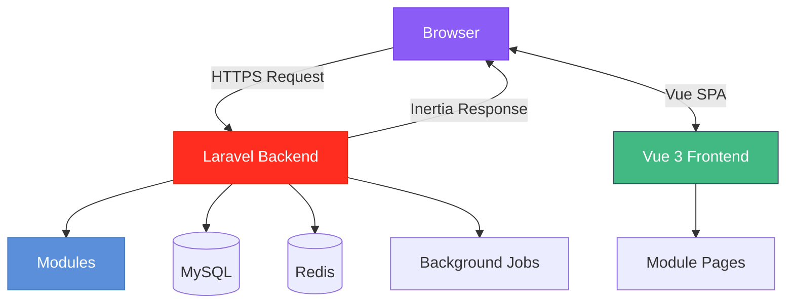

# Architecture Overview

Saucebase is a modular Laravel SaaS starter kit built on the VILT stack (Vue 3, Inertia.js, Laravel 12, Tailwind CSS 4). It combines Laravel's backend power with Vue's reactive frontend, connected seamlessly through Inertia.js.

## What is Saucebase?

Saucebase is designed for developers building SaaS applications who want:

- **Modular architecture** for organizing features as self-contained packages
- **Copy-and-own philosophy** where you own and customize all code
- **Modern stack** with TypeScript, Vue 3 Composition API, and Laravel 12
- **Production-ready** setup with Docker, SSR support, testing, and code quality tools

It's not a framework—it's a starting point with working code you can understand, modify, and build upon.

## High-Level Architecture



**The flow**:
1. Browser requests a page
2. Laravel routes to a controller
3. Controller returns Inertia response (JSON with component name and props)
4. Vue receives props and renders the appropriate page
5. Subsequent navigation happens client-side without full page reloads

This architecture eliminates the need for a separate REST API while providing a modern SPA experience.

## Core Concepts

### Modular by Design

Saucebase uses modules to organize features. Each module is self-contained with its own:
- Routes, controllers, and models
- Vue pages and components
- Migrations and tests
- Translations

Modules live in your repository (`modules/<Name>/`), not in external packages. You own the code and can modify it freely.

**Learn more**: [Module System Architecture](/architecture/module-system)

### Inertia.js: No API Required

Traditional SPAs require building and maintaining API endpoints. Inertia.js eliminates this by allowing controllers to pass data directly to Vue components as props.

```php
// Controller
return Inertia::render('Dashboard', [
    'stats' => $stats,
    'user' => $user,
]);
```

Vue components receive these props with full type safety:

```vue
<script setup lang="ts">
const props = defineProps<{
    stats: Stats;
    user: User;
}>();
</script>
```

No API layer, no REST endpoints, no GraphQL schema. Just straightforward data flow from backend to frontend.

**Learn more**: [Frontend Architecture](/architecture/frontend)

### Server-Side Rendering (Opt-In)

SSR is available but disabled by default. Enable it per-route for pages that benefit from SEO:

```php
// Public page with SEO benefits
return Inertia::render('Products/Index')->withSSR();

// Authenticated page without SSR
return Inertia::render('Dashboard')->withoutSSR();
```

This gives you control over when SSR overhead makes sense.

**Learn more**: [SSR Guide](/fundamentals/ssr)

### Type Safety End-to-End

TypeScript flows from backend to frontend:
- Controllers define data types
- Inertia props are type-safe
- Vue components get autocomplete and type checking
- Build-time validation catches errors early

This makes refactoring safe and development faster.

### Copy-and-Own Philosophy

When you install a module, its code is copied into your repository. You're not depending on external packages—you own the code.

**Why?** Full control, no version conflicts, easy customization, simplified debugging.

**Trade-off?** No automatic updates, but you gain complete ownership.

**Learn more**: [Design Philosophy](/architecture/philosophy)

## Technology Stack

### Backend
- **Laravel 12** - PHP framework
- **PHP 8.4+** - Modern PHP with types
- **MySQL 8** - Primary database
- **Redis** - Cache, sessions, queues
- **Inertia.js Server** - Connects Laravel to Vue

### Frontend
- **Vue 3** - Composition API
- **TypeScript 5.8** - Type-safe JavaScript
- **Inertia.js Client** - SPA routing
- **Tailwind CSS 4** - Utility-first CSS
- **Vite 6** - Build tool with HMR

### Infrastructure
- **Docker** - Consistent development environment
- **Nginx** - Web server
- **Mailpit** - Email testing
- **PHPUnit** - Backend testing
- **Playwright** - E2E testing

## Request Flow

### Initial Page Load

1. Browser requests `/dashboard`
2. Nginx forwards to Laravel
3. Route resolves to controller
4. Controller returns Inertia response (JSON)
5. Blade template renders with embedded JSON
6. Vue hydrates and displays the page

### Subsequent Navigation (SPA)

1. User clicks a link
2. Inertia intercepts and makes XHR request
3. Laravel returns JSON (no full HTML)
4. Vue swaps page component
5. URL updates, page renders instantly

This combines the best of traditional server-side apps (simple data flow) with modern SPAs (smooth navigation).

## Module System Overview

Modules are the organizational foundation of Saucebase. Understanding how they work helps you build features that align with the architecture.

### Structure

```
modules/Auth/
├── app/           # Controllers, models, services
├── resources/js/  # Vue pages and components
├── routes/        # Web and API routes
├── database/      # Migrations and seeders
└── tests/         # Feature and unit tests
```

### Discovery

Modules are tracked in `modules_statuses.json`. Only enabled modules are loaded:

```json
{
    "Auth": true,
    "Settings": true
}
```

### Integration

- **Routes** auto-load from `routes/web.php`
- **Migrations** auto-discover from `database/migrations/`
- **Assets** auto-collect via `module-loader.js`
- **Pages** resolve via namespace syntax (`Auth::Login`)

Everything happens automatically based on the enabled/disabled state.

**Learn more**: [Module System Architecture](/architecture/module-system)

## Why This Architecture?

Every architectural decision in Saucebase serves a purpose:

- **Inertia.js** eliminates API boilerplate
- **Modules** provide organization without microservice complexity
- **Copy-and-own** gives you control over your code
- **TypeScript** catches errors before users see them
- **Docker** ensures consistency across environments
- **Opt-in SSR** provides SEO benefits without performance costs

These aren't arbitrary choices—they're deliberate trade-offs that prioritize developer experience, maintainability, and simplicity.

**Learn more**: [Design Philosophy](/architecture/philosophy)

## Next Steps

Dive deeper into specific architectural areas:

- **[Design Philosophy](/architecture/philosophy)** - Why Saucebase is built this way
- **[Module System](/architecture/module-system)** - How modular architecture works
- **[Frontend Architecture](/architecture/frontend)** - Vue, Inertia, and TypeScript patterns
- **[Backend Architecture](/architecture/backend)** - Laravel patterns and practices
- **[SSR Guide](/fundamentals/ssr)** - Server-side rendering details
- **[Modules Guide](/fundamentals/modules)** - Working with modules in practice

Understanding the architecture helps you build features that feel natural in Saucebase and make the most of its design.
