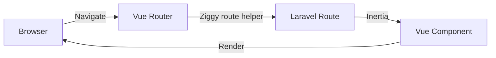

# Routing

Saucebase uses Laravel's routing system with Inertia.js for seamless SPA navigation. This guide covers how routing works in the modular architecture and how to use Ziggy for client-side routing.

## Overview

Saucebase routing combines three key components:

1. **Laravel Routes** - Define server-side endpoints
2. **Inertia.js** - Handle SPA navigation without page reloads
3. **Ziggy** - Access Laravel routes from JavaScript/TypeScript



## Defining Routes

### Core Application Routes

Core routes are defined in `routes/web.php`:

```php
// routes/web.php
use Illuminate\Support\Facades\Route;
use Inertia\Inertia;

Route::get('/', function () {
    return Inertia::render('Index')->withSSR();
});

Route::get('/dashboard', function () {
    return Inertia::render('Dashboard');
})->middleware('auth');
```

### Module Routes

Modules define their own routes in `modules/<ModuleName>/routes/web.php`:

```php
// modules/Auth/routes/web.php
use Illuminate\Support\Facades\Route;
use Modules\Auth\app\Http\Controllers\AuthController;

Route::prefix('auth')->name('auth.')->group(function () {
    Route::get('/login', [AuthController::class, 'showLogin'])->name('login');
    Route::post('/login', [AuthController::class, 'login']);
    Route::post('/logout', [AuthController::class, 'logout'])->name('logout');
});
```

Module routes are automatically loaded when the module is enabled.

## Inertia Page Resolution

Saucebase extends Inertia's page resolution to support modular architecture with **namespace syntax**.

### Core Pages

Render pages from `resources/js/pages/`:

```php
// Renders: resources/js/pages/Dashboard.vue
return Inertia::render('Dashboard');

// Renders: resources/js/pages/Settings/Profile.vue
return Inertia::render('Settings/Profile');
```

### Module Pages

Use namespace syntax to render module pages from `modules/<ModuleName>/resources/js/pages/`:

```php
// Renders: modules/Auth/resources/js/pages/Login.vue
return Inertia::render('Auth::Login');

// Renders: modules/Settings/resources/js/pages/Index.vue
return Inertia::render('Settings::Index');

// Renders: modules/Settings/resources/js/pages/Profile/Edit.vue
return Inertia::render('Settings::Profile/Edit');
```

**Namespace format**: `ModuleName::PagePath`

### How It Works

The `resolveModularPageComponent()` function in `resources/js/lib/utils.ts` handles page resolution:

1. Checks if the page name contains `::`
2. If yes, extracts module name and page path
3. Resolves to: `modules/<Module>/resources/js/pages/<Page>.vue`
4. If no, resolves to: `resources/js/pages/<Page>.vue`

## Route Groups and Middleware

### Grouping Routes

Use Laravel's route groups to organize routes:

```php
// Authenticated routes
Route::middleware(['auth'])->group(function () {
    Route::get('/dashboard', fn() => Inertia::render('Dashboard'));
    Route::get('/profile', fn() => Inertia::render('Profile'));
});

// Admin routes
Route::middleware(['auth', 'role:admin'])->prefix('admin')->group(function () {
    Route::get('/users', fn() => Inertia::render('Admin/Users'));
});
```

### Common Middleware

Saucebase includes these middleware by default:

- `auth` - Require authentication
- `guest` - Require guest (not authenticated)
- `role:admin` - Require admin role (Spatie Permission)
- `permission:edit-posts` - Require specific permission

## Client-Side Routing with Ziggy

Ziggy makes Laravel routes available in JavaScript/TypeScript.

### Installation

Ziggy is already configured in Saucebase. Routes are available via the global `route()` function.

### Basic Usage

```typescript
// Generate URLs
route('dashboard'); // /dashboard
route('settings.profile'); // /settings/profile

// Routes with parameters
route('user.show', { id: 1 }); // /users/1
route('post.show', { post: 42 }); // /posts/42

// Multiple parameters
route('post.comments.show', { post: 1, comment: 5 }); // /posts/1/comments/5
```

### Query Strings

Add query parameters using the `_query` option:

```typescript
route('search', {
    _query: {
        q: 'laravel',
        page: 2,
    },
}); // /search?q=laravel&page=2
```

### Route Checking

```typescript
// Check if route exists
route().has('dashboard'); // true/false

// Check current route
route().current(); // 'dashboard'
route().current('dashboard'); // true/false

// Wildcard matching
route().current('settings.*'); // true if on any settings.* route
```

### Navigation with Inertia

Combine Ziggy with Inertia's router for SPA navigation:

```vue
<script setup lang="ts">
import { router } from '@inertiajs/vue3';

// Navigate to a route
const goToDashboard = () => {
    router.visit(route('dashboard'));
};

// Navigate with method
const deletePost = (id: number) => {
    router.delete(route('post.destroy', { post: id }));
};

// Navigate with data
const updateProfile = (data: ProfileData) => {
    router.put(route('profile.update'), data);
};
</script>

<template>
    <Link :href="route('dashboard')">Dashboard</Link>
    <button @click="goToDashboard">Go to Dashboard</button>
</template>
```

## Route Model Binding

Laravel's route model binding works seamlessly with Inertia:

```php
use App\Models\Post;

// Automatic binding by ID
Route::get('/posts/{post}', function (Post $post) {
    return Inertia::render('Posts/Show', [
        'post' => $post,
    ]);
});

// Custom binding (by slug)
Route::get('/posts/{post:slug}', function (Post $post) {
    return Inertia::render('Posts/Show', [
        'post' => $post,
    ]);
});
```

Client-side usage:

```typescript
// Works with both ID and custom bindings
route('post.show', { post: 1 }); // /posts/1
route('post.show', { post: 'my-first-post' }); // /posts/my-first-post
```

## Named Routes

Always use named routes for maintainability:

```php
// ✅ Good: Named route
Route::get('/dashboard', fn() => Inertia::render('Dashboard'))
    ->name('dashboard');

// ✅ Good: Route group names
Route::prefix('settings')->name('settings.')->group(function () {
    Route::get('/', fn() => Inertia::render('Settings/Index'))->name('index');
    Route::get('/profile', fn() => Inertia::render('Settings/Profile'))->name('profile');
});
// Creates: settings.index, settings.profile

// ❌ Bad: Unnamed route
Route::get('/dashboard', fn() => Inertia::render('Dashboard'));
```

## Locale Routing

Saucebase supports multi-language routing with locale prefixes:

```php
// routes/web.php
Route::get('/locale/{locale}', function ($locale) {
    if (in_array($locale, ['en', 'pt_BR'])) {
        session(['locale' => $locale]);
    }
    return redirect()->back();
})->name('locale');
```

Client-side usage:

```vue
<script setup lang="ts">
import { router } from '@inertiajs/vue3';

const changeLocale = (locale: string) => {
    router.visit(route('locale', { locale }));
};
</script>

<template>
    <button @click="changeLocale('en')">English</button>
    <button @click="changeLocale('pt_BR')">Português</button>
</template>
```

## API Routes

API routes are defined in `routes/api.php` and module `routes/api.php`:

```php
// routes/api.php
use Illuminate\Support\Facades\Route;

Route::middleware('auth:sanctum')->group(function () {
    Route::get('/user', function (Request $request) {
        return $request->user();
    });
});
```

API routes are automatically prefixed with `/api` and use stateless authentication.

## Route Caching

In production, cache routes for better performance:

```bash
# Cache routes
php artisan route:cache

# Clear route cache
php artisan route:clear

# List all routes
php artisan route:list
```

:::warning Route Caching Limitation
Route caching doesn't work with closures. Always use controller methods in production routes.

```php
// ✅ Works with caching
Route::get('/dashboard', [DashboardController::class, 'index']);

// ❌ Doesn't work with caching
Route::get('/dashboard', fn() => Inertia::render('Dashboard'));
```
:::

## Security Best Practices

### CSRF Protection

All POST, PUT, PATCH, DELETE routes are protected by CSRF middleware by default:

```vue
<script setup lang="ts">
import { useForm } from '@inertiajs/vue3';

const form = useForm({
    name: '',
    email: '',
});

const submit = () => {
    // CSRF token automatically included
    form.post(route('profile.update'));
};
</script>
```

### Route Filtering

Consider filtering routes exposed to the frontend in `config/ziggy.php`:

```php
return [
    'except' => ['admin.*', 'sanctum.*', '_ignition.*'],
];
```

This reduces bundle size and hides internal routes (though it's **not a security mechanism**).

### Authorization

Always implement proper authorization:

```php
// Using middleware
Route::get('/posts/{post}/edit', [PostController::class, 'edit'])
    ->middleware('can:update,post');

// Using gates in controller
public function edit(Post $post)
{
    $this->authorize('update', $post);

    return Inertia::render('Posts/Edit', ['post' => $post]);
}
```

## Common Patterns

### Redirects After Actions

```php
public function store(Request $request)
{
    $post = Post::create($request->validated());

    return redirect()->route('post.show', $post)
        ->with('success', 'Post created successfully');
}
```

### Back Button Navigation

```php
return redirect()->back()->with('error', 'Something went wrong');
```

### Flash Messages

Flash messages persist through redirects:

```php
return redirect()->route('dashboard')
    ->with('success', 'Profile updated!')
    ->with('error', 'Email already taken');
```

Access in Vue:

```vue
<script setup lang="ts">
import { usePage } from '@inertiajs/vue3';

const page = usePage();
const flash = computed(() => page.props.flash);
</script>

<template>
    <div v-if="flash.success" class="alert-success">
        {{ flash.success }}
    </div>
</template>
```

## Troubleshooting

### Routes Not Found (404)

1. **Clear route cache**: `php artisan route:clear`
2. **Check module is enabled**: Verify `modules_statuses.json`
3. **List all routes**: `php artisan route:list`
4. **Check middleware**: Ensure you're authenticated if route requires auth

### Ziggy Routes Not Available

1. **Rebuild assets**: `npm run build` or restart `npm run dev`
2. **Check Ziggy config**: `config/ziggy.php`
3. **Verify routes are named**: Unnamed routes aren't available in Ziggy

### Module Routes Not Loading

1. **Enable module**: `php artisan module:enable <ModuleName>`
2. **Clear cache**: `php artisan optimize:clear`
3. **Check routes file exists**: `modules/<ModuleName>/routes/web.php`

### Inertia Page Not Found

1. **Check page path**: Verify file exists at resolved path
2. **Rebuild assets**: Module pages need `npm run build` after changes
3. **Check namespace syntax**: Use `Module::Page` for module pages

## Next Steps

- [Translations](/fundamentals/translations) - Learn about multi-language support
- [SSR](/fundamentals/ssr) - Understand server-side rendering
- [Modules](/fundamentals/modules) - Learn about the Auth module for authentication
