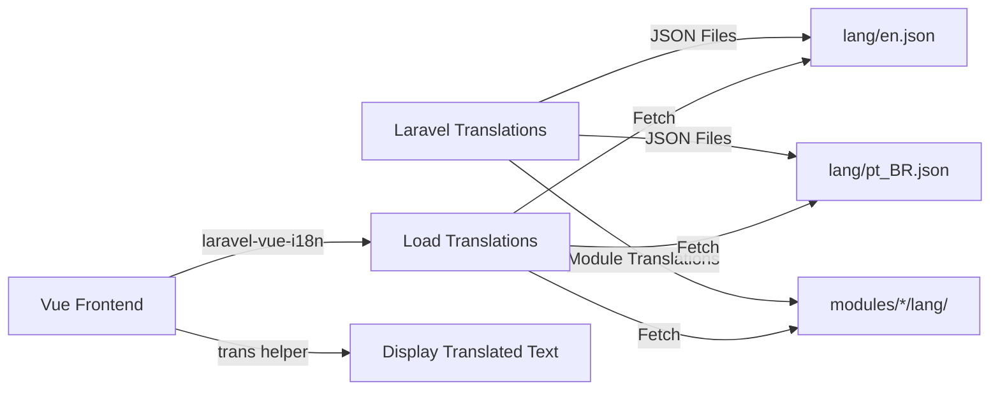

# Translations (i18n)

Saucebase provides full internationalization (i18n) support using Laravel's translation system on the backend and `laravel-vue-i18n` on the frontend. This guide covers how to manage translations across your application and modules.

## Overview

Saucebase supports multiple languages out of the box:

- **Default languages**: English (`en`), Portuguese Brazil (`pt_BR`)
- **Backend**: Laravel translation system
- **Frontend**: `laravel-vue-i18n` (loads Laravel translation files in Vue)
- **Module support**: Each module can have its own translations
- **Dynamic loading**: Translations loaded asynchronously on demand

## Architecture



## Translation Files

### Core Application Translations

```
lang/
├── en.json                 # English translations
│   {
│       "welcome": "Welcome",
│       "logout": "Logout",
│       "dashboard": "Dashboard"
│   }
└── pt_BR.json              # Portuguese (Brazil) translations
    {
        "welcome": "Bem-vindo",
        "logout": "Sair",
        "dashboard": "Painel"
    }
```

### Module Translations

Modules have their own translation directories:

```
modules/Auth/lang/
├── en/
│   └── auth.php
│       return [
│           'failed' => 'These credentials do not match our records.',
│           'throttle' => 'Too many login attempts.',
│       ];
└── pt_BR/
    └── auth.php
        return [
            'failed' => 'Estas credenciais não correspondem aos nossos registos.',
            'throttle' => 'Muitas tentativas de login.',
        ];
```

## Backend Usage

### Translation Strings

```php
// Simple translation
__('welcome');  // "Welcome"

// Namespaced (from PHP files)
__('auth.failed');  // "These credentials do not match our records."

// Module translations
trans('auth::auth.failed');  // From modules/Auth/lang/en/auth.php

// With replacements
__('Hello, :name', ['name' => 'John']);  // "Hello, John"

// Pluralization
trans_choice('There is one apple|There are many apples', $count);

// Check if translation exists
Lang::has('welcome');  // true/false
```

### Using in Controllers

```php
class AuthController extends Controller
{
    public function login(LoginRequest $request)
    {
        if (!Auth::attempt($request->validated())) {
            return back()->withErrors([
                'email' => __('auth.failed'),
            ]);
        }

        return redirect()
            ->route('dashboard')
            ->with('success', __('Welcome back!'));
    }
}
```

### Using in Validation

```php
class StorePostRequest extends FormRequest
{
    public function rules(): array
    {
        return [
            'title' => 'required|max:255',
            'content' => 'required',
        ];
    }

    public function messages(): array
    {
        return [
            'title.required' => __('validation.required', ['attribute' => 'title']),
            'content.required' => __('validation.required', ['attribute' => 'content']),
        ];
    }
}
```

### Using in Blade Templates

```blade
<!-- Simple translation -->
<h1>{{ __('welcome') }}</h1>

<!-- With replacements -->
<p>{{ __('Hello, :name', ['name' => $user->name]) }}</p>

<!-- Blade directive -->
@lang('welcome')

<!-- Choice -->
@choice('There is one apple|There are many apples', $count)
```

## Frontend Usage

### Translation Helper

The `trans()` helper is available globally in Vue components:

```vue
<script setup lang="ts">
import { trans } from 'laravel-vue-i18n';

// In script
const welcomeMessage = trans('welcome');
const greeting = trans('Hello, :name', { name: 'John' });
</script>

<template>
    <!-- Direct usage in template -->
    <h1>{{ trans('welcome') }}</h1>

    <!-- With replacements -->
    <p>{{ trans('Hello, :name', { name: user.name }) }}</p>

    <!-- Pluralization -->
    <p>{{ transChoice('There is one apple|There are many apples', count) }}</p>
</template>
```

### Translation Methods

```typescript
import { trans, transChoice, loadLanguageAsync } from 'laravel-vue-i18n';

// Simple translation
trans('welcome');  // "Welcome"

// With replacements
trans('Hello, :name', { name: 'John' });  // "Hello, John"

// Pluralization
transChoice('There is one apple|There are many apples', 1);  // "There is one apple"
transChoice('There is one apple|There are many apples', 5);  // "There are many apples"

// Check if translation key exists
isLoaded('welcome');  // true/false

// Get current locale
getActiveLanguage();  // "en"

// Load language asynchronously
await loadLanguageAsync('pt_BR');
```

### Composable for Locale Management

Create a reusable composable:

```typescript
// resources/js/composables/useLocale.ts
import { ref, computed } from 'vue';
import { loadLanguageAsync, getActiveLanguage } from 'laravel-vue-i18n';
import { router } from '@inertiajs/vue3';

export function useLocale() {
    const currentLocale = ref(getActiveLanguage());

    const availableLocales = [
        { code: 'en', name: 'English', flag: '🇺🇸' },
        { code: 'pt_BR', name: 'Português (BR)', flag: '🇧🇷' },
    ];

    const setLocale = async (locale: string) => {
        // Load translations
        await loadLanguageAsync(locale);

        // Update local state
        currentLocale.value = locale;

        // Persist on server
        router.visit(route('locale', { locale }), {
            preserveState: true,
            preserveScroll: true,
        });
    };

    return {
        currentLocale,
        availableLocales,
        setLocale,
    };
}
```

Usage:

```vue
<script setup lang="ts">
import { useLocale } from '@/composables/useLocale';

const { currentLocale, availableLocales, setLocale } = useLocale();
</script>

<template>
    <div>
        <span>{{ trans('current_language') }}: {{ currentLocale }}</span>

        <button
            v-for="locale in availableLocales"
            :key="locale.code"
            @click="setLocale(locale.code)"
            :class="{ active: currentLocale === locale.code }"
        >
            {{ locale.flag }} {{ locale.name }}
        </button>
    </div>
</template>
```

## Language Selector Component

Saucebase includes a built-in `LanguageSelector` component:

```vue
<script setup lang="ts">
import LanguageSelector from '@/components/LanguageSelector.vue';
</script>

<template>
    <header>
        <nav>
            <LanguageSelector />
        </nav>
    </header>
</template>
```

### Customizing LanguageSelector

```vue
<!-- resources/js/components/LanguageSelector.vue -->
<script setup lang="ts">
import { computed } from 'vue';
import { usePage, router } from '@inertiajs/vue3';
import { loadLanguageAsync } from 'laravel-vue-i18n';
import type { PageProps } from '@/types/global';

const page = usePage<PageProps>();
const locale = computed(() => page.props.locale);

const languages = [
    { code: 'en', name: 'English' },
    { code: 'pt_BR', name: 'Português (BR)' },
];

const changeLanguage = async (newLocale: string) => {
    await loadLanguageAsync(newLocale);

    router.visit(route('locale', { locale: newLocale }), {
        preserveState: true,
        preserveScroll: true,
    });
};
</script>

<template>
    <select
        :value="locale"
        @change="changeLanguage($event.target.value)"
        class="language-selector"
    >
        <option
            v-for="lang in languages"
            :key="lang.code"
            :value="lang.code"
        >
            {{ lang.name }}
        </option>
    </select>
</template>
```

## Locale Switching

### Backend Route

```php
// routes/web.php
Route::get('/locale/{locale}', function ($locale) {
    if (in_array($locale, ['en', 'pt_BR'])) {
        session(['locale' => $locale]);
        app()->setLocale($locale);
    }

    return redirect()->back();
})->name('locale');
```

### Middleware

Set locale from session:

```php
// app/Http/Middleware/SetLocale.php
class SetLocale
{
    public function handle(Request $request, Closure $next): Response
    {
        $locale = session('locale', config('app.locale'));

        if (in_array($locale, config('app.available_locales'))) {
            app()->setLocale($locale);
        }

        return $next($request);
    }
}

// Register in bootstrap/app.php
->withMiddleware(function (Middleware $middleware) {
    $middleware->web(append: [
        SetLocale::class,
    ]);
})
```

### Configuration

```php
// config/app.php
'locale' => env('APP_LOCALE', 'en'),
'fallback_locale' => 'en',
'available_locales' => ['en', 'pt_BR'],
```

## Module Translations

### Module Translation Structure

```
modules/Auth/lang/
├── en/
│   ├── auth.php           # Authentication strings
│   ├── validation.php     # Validation messages
│   └── passwords.php      # Password reset strings
└── pt_BR/
    ├── auth.php
    ├── validation.php
    └── passwords.php
```

### Module Translation Loading

Module translations are automatically loaded by the `ModuleServiceProvider`:

```php
abstract class ModuleServiceProvider extends ServiceProvider
{
    protected function registerTranslations(): void
    {
        $langPath = module_path($this->name, 'lang');

        if (is_dir($langPath)) {
            $this->loadTranslationsFrom($langPath, $this->nameLower);
        }
    }
}
```

### Using Module Translations

```php
// Backend: Use module namespace
trans('auth::auth.failed');
trans('auth::passwords.reset');

// Frontend: Same key structure
trans('auth::auth.failed');
```

### Frontend Module Translation Loading

Module translations are automatically discovered by the `module-loader.js`:

```javascript
// module-loader.js
export function collectModuleLangPaths() {
    const enabledModules = getEnabledModules();
    const langPaths = [];

    enabledModules.forEach((moduleName) => {
        const langPath = `./modules/${moduleName}/lang`;
        if (fs.existsSync(langPath)) {
            langPaths.push(langPath);
        }
    });

    return langPaths;
}
```

Vite configuration automatically includes module translations:

```javascript
// vite.config.js
import { collectModuleLangPaths } from './module-loader.js';

i18nVue({
    resolve: async (lang) => {
        const paths = [
            `../../lang/${lang}.json`,
            ...collectModuleLangPaths().map(p => `${p}/${lang}.json`)
        ];

        // Load and merge all translation files
    },
});
```

## Adding New Languages

### 1. Create Translation Files

```bash
# Core translations
touch lang/es.json

# Module translations
mkdir -p modules/Auth/lang/es
touch modules/Auth/lang/es/auth.php
```

### 2. Add Translations

```json
// lang/es.json
{
    "welcome": "Bienvenido",
    "logout": "Cerrar sesión",
    "dashboard": "Panel de control"
}
```

```php
// modules/Auth/lang/es/auth.php
return [
    'failed' => 'Estas credenciales no coinciden con nuestros registros.',
    'throttle' => 'Demasiados intentos de inicio de sesión.',
];
```

### 3. Update Configuration

```php
// config/app.php
'available_locales' => ['en', 'pt_BR', 'es'],
```

### 4. Add to Language Selector

```typescript
const languages = [
    { code: 'en', name: 'English' },
    { code: 'pt_BR', name: 'Português (BR)' },
    { code: 'es', name: 'Español' },
];
```

## Best Practices

### ✅ Do

- Use JSON files for simple key-value translations
- Use PHP files for complex translations with arrays
- Namespace module translations properly
- Provide fallback translations
- Use translation keys as variables in code
- Test all languages before deployment
- Keep translation keys descriptive
- Use placeholders for dynamic content

```vue
<!-- ✅ Good: Translation key -->
<h1>{{ trans('welcome_message') }}</h1>

<!-- ❌ Bad: Hardcoded text -->
<h1>Welcome</h1>
```

### ❌ Don't

- Hardcode strings in code
- Mix languages in the same file
- Use translation keys as full sentences
- Forget pluralization
- Skip module translations
- Assume English is always loaded

## Translation Key Organization

### Naming Convention

```json
{
    // General
    "app_name": "Saucebase",

    // Navigation
    "nav.home": "Home",
    "nav.dashboard": "Dashboard",
    "nav.settings": "Settings",

    // Actions
    "action.save": "Save",
    "action.cancel": "Cancel",
    "action.delete": "Delete",

    // Messages
    "message.success": "Operation successful",
    "message.error": "An error occurred",

    // Forms
    "form.email": "Email",
    "form.password": "Password",

    // Validation
    "validation.required": "This field is required",
    "validation.email": "Invalid email format"
}
```

## Dynamic Pluralization

```vue
<script setup lang="ts">
import { transChoice } from 'laravel-vue-i18n';

const postCount = ref(0);
</script>

<template>
    <!-- English: "0 posts" / "1 post" / "5 posts" -->
    <p>{{ transChoice('{0} No posts|{1} :count post|[2,*] :count posts', postCount, { count: postCount }) }}</p>
</template>
```

Translation file:

```json
{
    "posts_count": "{0} No posts|{1} :count post|[2,*] :count posts"
}
```

## Troubleshooting

### Translations Not Loading

```bash
# Clear Laravel caches
php artisan config:clear
php artisan cache:clear

# Rebuild frontend assets
npm run build

# Restart dev server
npm run dev
```

### Missing Translations

```typescript
// Check if translation exists
import { isLoaded } from 'laravel-vue-i18n';

if (!isLoaded('my.key')) {
    console.warn('Translation key not found: my.key');
}
```

### Module Translations Not Working

1. Check module is enabled: `cat modules_statuses.json`
2. Verify language files exist: `ls modules/Auth/lang/en/`
3. Rebuild assets: `npm run build`
4. Clear caches: `php artisan optimize:clear`

## Next Steps

- [Dark & Light Mode](/fundamentals/theme-mode) - Learn about theme switching
- [Routing](/fundamentals/routing) - Understand routing system
- [SSR](/fundamentals/ssr) - Server-side rendering configuration
